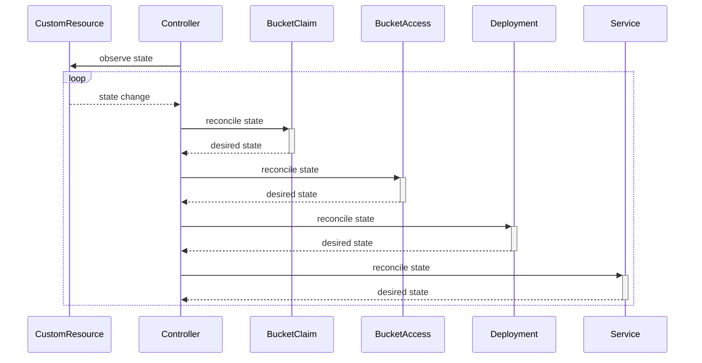
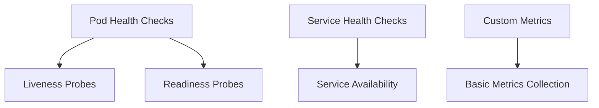

## Overview

The **Registry Operator** is being developed to simplify the management and operation of CNCF Distribution Registry instances within Kubernetes environments. It automates tasks such as deployment, scaling and upgrades of container image registries. By providing a streamlined and automated approach, the Registry Operator aims to enhance the developer and DevOps experience, reduce operational overhead, and ensure the registry remains highly available and performant.

## Problem Statement

Managing stateful applications like container image registries manually in Kubernetes can be challenging due to various reasons:

1. **Complexity in Configuration**: Setting up and managing a container registry requires configuration of various components such as storage, networking, and access controls. Manually managing these configurations can lead to inconsistencies and errors.

2. **Scaling and Upgrades**: Without an automated process, scaling registry instances or upgrading them becomes time-consuming and prone to downtime or misconfiguration.

3. **Monitoring and Alerts**: Manually setting up monitoring for registry health and performance can be inefficient, and failure to detect issues early may result in downtime.

The Registry Operator addresses these pain points by automating these tasks, ensuring reliable and efficient operation of container image registries in Kubernetes.

## Objectives

The primary objectives of the **Registry Operator** are as follows:

1. **Automate Deployment and Configuration**: 
   - Simplify the process of deploying CNCF Distribution Registry instances by automating the configuration of storage, networking, and access controls.
   - Provide a declarative approach using Kubernetes Custom Resource Definitions (CRDs) to manage registry instances.

2. **Seamless Scaling and Upgrades**: 
   - Ensure that scaling the registry to meet demand can be done effortlessly, without manual intervention.
   - Support zero-downtime upgrades for registry instances, ensuring business continuity during version changes.

3. **High Availability and Fault Tolerance**:
   - Ensure the registry remains highly available, even during node failures or resource limitations.
   - Build in self-healing mechanisms to automatically recover from common failure scenarios.

4. **Monitoring and Alerting**: 
   - Integrate with popular monitoring tools (e.g., Prometheus, Grafana) to provide real-time health metrics, performance monitoring, and usage statistics.
   - Automate alerting to notify administrators of critical issues before they impact operations.

6. **Secure and Compliant Operations**: 
   - Enforce security best practices for managing access controls, securing registry communication, and handling sensitive data.
   - Ensure compliance with industry standards and organizational policies for container registry management.

7. **Ease of Use for DevOps Teams**:
   - Provide clear documentation and user-friendly interfaces for configuring and managing registry instances.
   - Offer seamless integration with CI/CD pipelines to enhance DevOps workflows, allowing quick and efficient management of container images.

## MVP (Minimum Viable Product)

### Core Features

#### Custom Resource Definitions

```yaml
---
apiVersion: registry-operator.dev/v1alpha1
kind: Registry
metadata:
  name: my-registry
spec:
  replicas: 3          # Number of registry instances
  image: registry:2    # The container image for the registry

  storage:
    bucketClassName: my-s3-class              # Name of the BucketClass for which the BucketClaim and Bucket are provisioned
    bucketAccessClass: my-s3-access-class     # Name of the BucketAccessClass for which the BucketAccess and Secret are provisioned

  resources:
    requests:
      cpu: "500m"      # CPU resource requests
      memory: "1Gi"    # Memory resource requests
    limits:
      cpu: "1"         # CPU resource limits
      memory: "2Gi"    # Memory resource limits

  service:
    type: ClusterIP    # Kubernetes service type (can be ClusterIP, NodePort, or LoadBalancer)
    port: 5000         # Port for the registry service
```

#### Controller Logic

The **Registry Operator** controller is designed to ensure that the state of the container registry aligns with the desired configuration specified in the `Registry` CRD. It continuously monitors the state of both the custom resource and its dependencies, performing reconciliation as necessary to maintain the desired state.

**Key Responsibilities**:

1. **Observe State**:
   - The controller continuously observes the state of the `Registry` CRD and its dependent resources, including Deployments, Services, etc.

2. **Handle State Changes**:
   - When any observed resource changes state (e.g., due to updates, failures, or scaling events), the controller is notified and takes appropriate action to reconcile the state.

3. **Reconcile State**:
   - The controller performs reconciliation operations to ensure that the actual state of the registry matches the desired state defined in the `Registry` CRD. This includes creating, updating, or deleting resources as necessary.

4. **Integration with Dependencies**:
   - The controller manages the lifecycle of related Kubernetes resources:
     - **Deployment**: Ensures the registry pods are correctly deployed and scaled.
     - **Service**: Manages access to the registry within the cluster.
     - **BucketClaim** and **BucketAccess**: Manages storage for the registry.

**Sequence Diagram**:



**Workflow**:

1. **Initial Observation**:
   - The controller starts by observing the state of the `Registry` CRD and related resources. It monitors any changes or updates.

2. **Reconciliation Loop**:
   - Whenever a state change is detected in the `Registry` CRD or its dependencies, the controller triggers a reconciliation loop.
   - In this loop, the controller:
     - Updates or creates `BucketClaim` and `BucketAccess` resources to meet the storage requirements.
     - Adjusts the `Deployment` to ensure the registry pods are running as desired.
     - Configures the `Service` to provide access to the registry.

3. **Ensure Desired State**:
   - The controller continuously ensures that all related resources align with the desired state specified in the `Registry` CRD.

#### Basic Health Checks

**Basic Health Checks** are crucial for ensuring that the container registry is operational and performing as expected. For the MVP, the health check mechanisms will include:

1. **Pod Health Checks**:
   - **Liveness Probes**: The controller will ensure that the registry pods have liveness probes configured. These probes will periodically check that the registry service is running and responsive.
   - **Readiness Probes**: The controller will also configure readiness probes to ensure that the registry pods are ready to serve traffic before routing requests to them.

2. **Service Health Checks**:
   - **Service Availability**: The controller will check that the Kubernetes Service for the registry is correctly exposing the registry pods and that the service endpoints are available.

3. **Custom Metrics**:
   - **Basic Metrics Collection**: The operator will expose basic metrics (e.g., request count, error rate) that can be collected by monitoring systems like Prometheus. These metrics will help in identifying potential issues and monitoring the overall health of the registry.



### Deliverables

- Deployed operator with CRD definitions and basic lifecycle management.
- Documentation and user guides for deploying and using the operator.
- Initial test suite for core features.

## Next Steps (Post-MVP Enhancements)

### Registry Template

To enhance flexibility and reduce duplication, the operator can introduce a `RegistryTemplate` CRD. This allows defining common configuration settings in a template that can be referenced and overridden in individual `Registry` instances.

```yaml
---
apiVersion: registry-operator.dev/v1alpha1
kind: RegistryTemplate
metadata:
  name: my-registry-template  # Global template name, not namespaced
spec:
  replicas: 3                 # Default number of registry instances
  image: registry:2           # Default container image for the registry

  storage:
    bucketClassName: my-s3-class              # Name of the BucketClass for which the BucketClaim and Bucket are provisioned
    bucketAccessClass: my-s3-access-class     # Name of the BucketAccessClass for which the BucketAccess and Secret are provisioned

  resources:
    requests:
      cpu: "500m"      # Default CPU resource requests
      memory: "1Gi"    # Default memory resource requests
    limits:
      cpu: "1"         # Default CPU resource limits
      memory: "2Gi"    # Default memory resource limits

  service:
    type: ClusterIP    # Default service type
    port: 5000         # Default port for the service
---
apiVersion: registry-operator.dev/v1alpha1
kind: Registry
metadata:
  name: my-registry
template: my-registry-template # Reference to the global template
spec:
  replicas: 5          # Override default replicas
```

#### How It Works:

1. **Define Template**: Create a `RegistryTemplate` resource that includes common settings and defaults for the registry.

2. **Reference Template**: Create `Registry` resources that reference the `RegistryTemplate` by name. Specific fields in the `Registry` CRD can override default values defined in the template.

3. **Apply Overrides**: The operator applies the template values and overrides from the `Registry` specification to configure the registry instances.

This approach streamlines configuration management, reduces duplication, and provides a centralized way to manage common settings for multiple registry instances.

### Pull-through Cache

To support pull-through caching for container images, the **Registry Operator** will introduce a `Cache` resource. This resource will allow configuring an external cache for registry images, enabling the registry to cache and serve images from a specified upstream registry.

For the MVP, the pull-through cache only supports using an empty path volume, and does not support PersistentVolumeClaims (PVCs) or object storage solutions.

**Cache CRD Definition**:

```yaml
---
apiVersion: registry-operator.dev/v1alpha1
kind: Cache
metadata:
  name: my-cache
spec:
  # URL of the upstream registry to cache images from
  upstreamRegistryURL: "https://my-upstream-registry.com"
  
  # Configuration for the cache volume
  volume:
    type: emptyDir       # Type of volume used for caching (supports ONLY emptyDir)
    size: 50Gi           # Size of the volume (optional, for reference)
    accessMode: ReadWriteOnce # Access mode for the volume (optional, for reference)

  # Optional configurations for cache behavior
  cacheTTL: "24h"       # Time-to-live for cached images
  maxCacheSize: "100Gi" # Maximum cache size
```

#### How It Works:

1. **Cache Configuration**:
   - Define a `Cache` resource with the URL of the upstream registry and the volume configuration. The registry operator will set up the cache based on this configuration.

2. **Image Caching**:
   - When a request for an image is made, the registry will first check the cache. If the image is not present in the cache, it will be pulled from the upstream registry and stored in the cache.

3. **Cache Management**:
   - The operator manages the cache based on the TTL and size settings. Cached images will be refreshed or removed according to these policies.

4. **Volume Handling**:
   - The `emptyDir` volume provides a temporary storage space for cached images.

### Advanced Features

1. **Automated Upgrades**
   - Support rolling updates for application deployments.
   - **Strategy for Automating Application Upgrades**:
     - The operator will leverage Kubernetes' built-in rolling update mechanism to ensure minimal disruption during upgrades.
     - A phased approach will be adopted:
       1. **Version Validation**: The operator will first validate the target version to ensure compatibility with the current registry setup.
       2. **Health Checks**: Post-upgrade, the operator will perform health checks on each instance to ensure that it has been upgraded successfully and is functioning as expected.
       3. **Rollback Mechanism**: In case of any issues during the upgrade process, the operator will support automatic rollback to a previous stable version to ensure continuity of service.

2. **Use Redis (or OSS alternative) as a metadata cache**
   - By default, the registry stores layer metadata in an in-memory map. The operator will add support for configuring Redis or compatible open-source alternatives (e.g., **Valkey**, **Garnet**, **Dragonfly**, **KeyDB**) to store and access metadata.
   - **Benefits**:
     - Improved performance in multi-instance, high-availability (HA) setups by externalizing the metadata store.
     - Redis or its alternatives provide persistent storage of metadata, reducing the overhead on memory usage in long-running deployments.
   - **Optional Redis Deployment**:
     - If a Redis (or compatible store) is not already available, the operator can optionally provision one in the cluster.
     - The Redis service can be deployed with high-availability configurations as needed by the registry's workload.

3. **Provision TLS certificates with cert-manager**
   - The operator will integrate with **cert-manager** to provision and manage TLS certificates automatically.
   - **Key Details**:
     - Cert-manager will issue certificates for the registry Ingress, ensuring secure HTTPS communication.
     - The operator will manage certificate renewal and ensure that the registry always has a valid TLS certificate.
     - Certificates can be automatically rotated when they expire or are nearing expiration.

4. **Provision local storage for the registry with filesystem storage**
   - The operator will support configuring the registry to use local storage through **PersistentVolumeClaims (PVCs)** with filesystem storage.
   - **Use Case**:
     - While PVC-based filesystem storage does not allow for HA deployments due to its stateful nature, it is still useful for certain registry setups, such as **pull-through caches**. This is particularly beneficial when high-performance local storage is provisioned.
     - This feature is especially helpful for environments where HA is not a strict requirement or for scenarios requiring fast, local storage for cached images.

   - **Configuration**:
     - The operator will allow specifying a PVC for the registry, which will be automatically created and bound to the registry deployment.
     - If using filesystem storage, the operator will ensure that the deployment is properly configured to avoid conflicts with HA setups, such as ensuring that the replica count is set to 1 for non-distributed setups.
     - The filesystem storage option provides a simplified, cost-effective approach for users needing local caching.

These advanced features will enhance the registry operator’s flexibility, supporting more complex deployment scenarios and advanced caching mechanisms to optimize performance and reliability.

### Testing and Validation

To ensure the **Registry Operator** is robust, scalable, and reliable, comprehensive testing will be conducted post-MVP. The testing strategy will focus on covering edge cases, scaling scenarios, and integration points with Kubernetes.

1. **Comprehensive Testing Strategy**:
    - **Unit Testing**: 
        - Each operator function (e.g., deployment, backup, scaling) will be unit tested to ensure individual components work as expected.
    - **Integration Testing**:
        - Test interactions between the operator and Kubernetes components (e.g., CRDs, controllers, volumes).
        - Validate the operator's integration with external tools such as monitoring systems (e.g., Prometheus), cloud storage, and CI/CD pipelines.
    - **Edge Case Testing**:
        - Simulate scenarios such as node failures, storage disruptions, and misconfigurations to ensure the operator can handle and recover from such events.
        - Test operator behavior during network outages or degraded performance to ensure high availability mechanisms are functioning properly.
    - **Scaling Tests**:
        - Validate the operator’s ability to scale the registry horizontally to meet increased demand.
        - Test for resource exhaustion scenarios (e.g., when CPU, memory, or storage limits are reached) to ensure that scaling, alerting, and self-healing mechanisms work correctly.

2. **End-to-End (E2E) Testing with Kyverno Chainsaw**:
    - **Kyverno Chainsaw** will be used for E2E testing to simulate real-world registry operations, ensuring that the entire lifecycle of the registry is properly validated. This includes:
        - **Automated Deployments**: Testing the full deployment flow of the registry from configuration to startup.
        - **Scaling and Upgrades**: Verifying that the operator can handle rolling upgrades and scaling operations without downtime.
        - **Backup and Recovery**: Ensuring that snapshot creation, backup storage, and recovery functions work as intended in various scenarios.

3. **Performance and Load Testing**:
    - Simulate high traffic and large-scale operations to measure performance and resource utilization.
    - Ensure the operator can maintain acceptable performance levels under heavy load, large numbers of container images, or numerous concurrent users.

## Future Integrations

### Runbooks

1. **Authentication**
    - The operator will integrate with common authentication mechanisms such as OAuth2, LDAP, and Kubernetes secrets for secure access to the container registry. It will manage authentication configurations and ensure that users and services can interact securely with the registry. Future plans include:
        - Support for token-based authentication.
        - Automated management of credentials and certificates.
        - Integration with Kubernetes Role-Based Access Control (RBAC) for fine-grained access control.
  
2. **Integration with UI**
    - The operator will integrate with the [Docker Registry UI](https://github.com/Joxit/docker-registry-ui), providing a graphical interface for managing and browsing container images. This integration will allow users to:
        - View and manage image tags.
        - Monitor registry activity and status through the UI.
        - Perform image lifecycle management (e.g., deletion, retagging) directly from the interface.

3. **Integration with ImagePuller Operator**
    - The Registry Operator will integrate with the [ImagePuller Operator](https://github.com/che-incubator/kubernetes-image-puller-operator), which pre-pulls container images into Kubernetes clusters for faster deployments. The key benefits of this integration include:
        - Coordinated image management between the registry and clusters, ensuring that images are available where and when needed.
        - Enhanced efficiency by reducing the time required to pull images during deployment.
        - Automated syncing of images between the registry and Kubernetes nodes.

4. **Alerting and Prometheus Integration**
    - The Registry Operator will be integrated with Prometheus for real-time monitoring and alerting. Key metrics like registry availability, image pull times, disk usage, and error rates will be exposed. Future plans include:
        - Configurable alert thresholds for key metrics, ensuring that operators are notified of potential issues before they impact the system.
        - Alerts for critical events like image pull failures, storage limits, and registry health.

5. **Grafana Dashboards**
    - The operator will include pre-configured Grafana dashboards to visualize registry performance, usage, and health. These dashboards will offer:
        - Real-time views of registry traffic, including image pulls and pushes.
        - Insights into resource utilization (e.g., CPU, memory, disk usage).
        - Historical trends to help operators understand usage patterns and anticipate future needs.
        - Customizable panels for specific metrics that align with the organization’s monitoring requirements.
