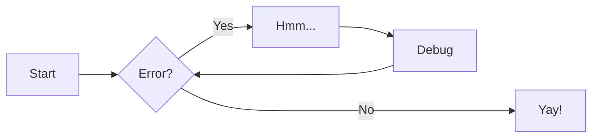

# Home

!!! info inline end "Lorem ipsum"

    Lorem ipsum dolor sit amet, consectetur
    adipiscing elit. Nulla et euismod nulla.
    Curabitur feugiat, tortor non consequat
    finibus, justo purus auctor massa, nec
    semper lorem quam in massa.

Lorem ipsum dolor sit amet, consectetur adipiscing elit, sed do eiusmod tempor incididunt ut labore et dolore magna aliqua. Ut enim ad minim veniam, quis nostrud exercitation ullamco laboris nisi ut aliquip ex ea commodo consequat. Duis aute irure dolor in reprehenderit in voluptate velit esse cillum dolore eu fugiat nulla pariatur. Excepteur sint occaecat cupidatat non proident, sunt in culpa qui officia deserunt mollit anim id est laborum.

## Code Block

<div class="grid cards" markdown>

-   :fontawesome-brands-golang: Go

    ---

    ```go
    import (
        "context"
        "fmt"
        "log/slog"
        "os"
    )

    func main() {
        if err := run(context.Background()); err != nil {
            slog.Error("critical failure, closing",
                "error", err)
            os.Exit(1)
        }
    }

    func run(ctx contex.Context) error {
        // ...
    }
    ```

-   C Example

    ---

    ```c
    #include <stdio.h>

    int main() {
        int n, i, sum = 0;

        printf("Enter a positive integer: ");
        scanf("%d", &n);

        for (i = 1; i <= n; ++i) {
            sum += i;
        }

        printf("Sum = %d", sum);
        return 0;
    }
    ```

-   YAML

    ---

    ```yaml
    foo:
    - bar:
        baz: !!baz
    baz: "bar" # something
    cux: null # TODO(foo): bar baz
    rex: 1.2
    ```

-   :fontawesome-brands-docker: Dockerfile

    ---

    ```docker
    FROM scratch

    # copy file
    COPY ./foo ./bar

    # set env
    ENV foo=bar
    ```
</div>

## Table

| Method      | Description                          |
| ----------- | ------------------------------------ |
| `GET`       | :material-check:     Fetch resource  |
| `PUT`       | :material-check-all: Update resource |
| `DELETE`    | :material-close:     Delete resource |

## Mermaid

???+ note "Foo, Bar, Baz"

    Lorem ipsum dolor sit amet, consectetur adipiscing elit. Nulla et euismod
    nulla. Curabitur feugiat, tortor non consequat finibus, justo purus auctor
    massa, nec semper lorem quam in massa.



## Annotations

Lorem ipsum dolor sit amet, (1) consectetur adipiscing elit.
{ .annotate }

1.  :man_raising_hand: I'm an annotation! I can contain `code`, __formatted
    text__, images, ... basically anything that can be expressed in Markdown.

## Footnotes

Lorem ipsum[^1] dolor sit amet, consectetur adipiscing elit.[^2]

[^1]: Lorem ipsum dolor sit amet, consectetur adipiscing elit.
[^2]:
    Lorem ipsum dolor sit amet, consectetur adipiscing elit. Nulla et euismod
    nulla. Curabitur feugiat, tortor non consequat finibus, justo purus auctor
    massa, nec semper lorem quam in massa.

## Admonitions

???+ abstract "Foo, Bar, Baz"

    Lorem ipsum dolor sit amet, consectetur adipiscing elit. Nulla et euismod
    nulla. Curabitur feugiat, tortor non consequat finibus, justo purus auctor
    massa, nec semper lorem quam in massa.

???+ info "Foo, Bar, Baz"

    Lorem ipsum dolor sit amet, consectetur adipiscing elit. Nulla et euismod
    nulla. Curabitur feugiat, tortor non consequat finibus, justo purus auctor
    massa, nec semper lorem quam in massa.

???+ tip "Foo, Bar, Baz"

    Lorem ipsum dolor sit amet, consectetur adipiscing elit. Nulla et euismod
    nulla. Curabitur feugiat, tortor non consequat finibus, justo purus auctor
    massa, nec semper lorem quam in massa.

???+ success "Foo, Bar, Baz"

    Lorem ipsum dolor sit amet, consectetur adipiscing elit. Nulla et euismod
    nulla. Curabitur feugiat, tortor non consequat finibus, justo purus auctor
    massa, nec semper lorem quam in massa.

???+ question "Foo, Bar, Baz"

    Lorem ipsum dolor sit amet, consectetur adipiscing elit. Nulla et euismod
    nulla. Curabitur feugiat, tortor non consequat finibus, justo purus auctor
    massa, nec semper lorem quam in massa.

???+ warning "Foo, Bar, Baz"

    Lorem ipsum dolor sit amet, consectetur adipiscing elit. Nulla et euismod
    nulla. Curabitur feugiat, tortor non consequat finibus, justo purus auctor
    massa, nec semper lorem quam in massa.

???+ failure "Foo, Bar, Baz"

    Lorem ipsum dolor sit amet, consectetur adipiscing elit. Nulla et euismod
    nulla. Curabitur feugiat, tortor non consequat finibus, justo purus auctor
    massa, nec semper lorem quam in massa.

???+ danger "Foo, Bar, Baz"

    Lorem ipsum dolor sit amet, consectetur adipiscing elit. Nulla et euismod
    nulla. Curabitur feugiat, tortor non consequat finibus, justo purus auctor
    massa, nec semper lorem quam in massa.

???+ bug "Foo, Bar, Baz"

    Lorem ipsum dolor sit amet, consectetur adipiscing elit. Nulla et euismod
    nulla. Curabitur feugiat, tortor non consequat finibus, justo purus auctor
    massa, nec semper lorem quam in massa.

???+ example "Foo, Bar, Baz"

    Lorem ipsum dolor sit amet, consectetur adipiscing elit. Nulla et euismod
    nulla. Curabitur feugiat, tortor non consequat finibus, justo purus auctor
    massa, nec semper lorem quam in massa.

???+ quote "Foo, Bar, Baz"

    Lorem ipsum dolor sit amet, consectetur adipiscing elit. Nulla et euismod
    nulla. Curabitur feugiat, tortor non consequat finibus, justo purus auctor
    massa, nec semper lorem quam in massa.
